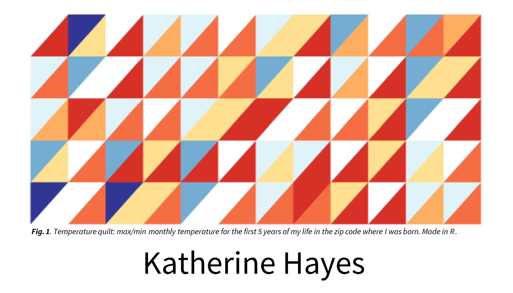

I'm making business cards for the first time. It feels odd. To make it feel less odd, I wanted to come up with some sort of fun, colorful graphic to cover one of the sides. But I didn't feel great about any of the stock designs I was seeing, and wanted something that felt more like me.

In my free time, I'm a very amateur fiber arts nerd. Even calling it "fiber arts" gives me away immediately. I used to sew some of my own clothes (mostly during covid), and knit often on zoom calls and in meetings. Technically, I've made a quilt before.

So, I landed on a quilt theme. But making tiny even triangles in powerpoint seemed fussy, and I wanted the colors to be random but somehow still cohesive.

From there it was a hop and a skip over to temperature quilts - a craft tradition where each day (or month) of the year gets a color based on the temperature, and you knit or sew them together into a record of the year's weather. Instead of fabric, I'd use ggplot.

```{r}
#| echo: false
#| warning: false
#| output: false
library(tidyverse)
library(cowplot)
library(knitr)
library(data.table)
library(here)
theme_set(theme_cowplot())
```

```{r}
#| label: locate
#| output: false
#| echo: false

if(params$user %in% 'KateWork'){
  # set directory
  
  knitr::opts_knit$set(root.dir = rprojroot::find_rstudio_root_file())
  
  # set input
  dataloc = paste0(here(), "/posts/Draft_temperaturequilt/data")
  
}

```

I downloaded 5 years of temperature from the General Mitchell Airport weather station, emailed to me in the form of a csv of daily maximum and minimum temperature.

```{r climate table}
#| tbl-cap-location: margin
#| tbl-cap: MKE weather data
#| echo: false
#| tbl-column: body

mke = read.csv(paste0(dataloc, "/mke_climate.csv"))

knitr::kable((mke))

```

Each row in the raw data is a single day. I want one value per month per year, so I'll summarize down to monthly minimums and maximums. The data includes a partial year (1999), which I'll drop so each row in the quilt represents a complete year.

```{r climate format}
#| warning: false
#| output: false

mke$DATE  <- as.Date(mke$DATE)
mke$year  <- as.numeric(format(mke$DATE, "%Y"))
mke$month <- as.numeric(format(mke$DATE, "%m"))

mke_sum <- mke %>%
  filter(year != 1999) %>%
  group_by(year, month) %>%
  summarize(min = min(TMIN),
            max = max(TMAX),
            .groups = "drop")

knitr::kable((mke_sum))
```

# Building the geometry

Next was figuring out how to plot right angle triangles. You can do it with geom_polygon() by setting the x,y coordinates for each of the three corners of the triangle.

```{r}
triangle = data.table(polygon.x = c(2,4,4), polygon.y = c(1,1,3))

ggplot(triangle, aes(x = polygon.x, y = polygon.y)) + geom_polygon()
```

To produce the other side of the triangle, you modify the coordinate for the second corner, like so.

```{r}
left.triangle = data.table(polygon.x = c(2,2,4), polygon.y = c(1,3,3))

ggplot(left.triangle, aes(x = polygon.x, y = polygon.y)) + geom_polygon()
```

Putting them together gets you both sections of the quilt block.

```{r}
left.triangle = data.table(polygon.x = c(2,2,4), polygon.y = c(1,3,3), triangle = "left")
right.triangle = data.table(polygon.x = c(2,4,4), polygon.y = c(1,1,3), triangle = "right")

both.triangle = rbind(left.triangle, right.triangle)

ggplot(both.triangle, aes(x = polygon.x, y = polygon.y, group = triangle)) + geom_polygon()
```

So, I needed 12 months of columns, and decided I had room for 5 years (rows).

To tile this into a full quilt grid, I need to offset each block by 2 units in x and y. I started by building each row by hand to check if it worked, but eventually wrote a loop over rows — x-offsets are precomputed once and reused, and the y-offset for each row is just `(r - 1) * 2`.

```{r}

# map each year to a row index (1 = earliest year)
year_ranks <- mke_sum %>%
  distinct(year) %>%
  arrange(year) %>%
  mutate(triangle_row = row_number())

n_cols <- 12                           # months
n_rows <- max(year_ranks$triangle_row) # years in data

# x-offsets: each block is 2 units wide
add_vector <- c(0, 0, 0)
out_vector <- vector()
for (i in 1:n_cols) {
  out_vector <- c(out_vector, add_vector)
  add_vector <- add_vector + 2
}

# build all rows and columns in a single loop
all_blocks <- data.table()

for (r in 1:n_rows) {
  y_base <- (r - 1) * 2  # each row is 2 units tall

  right_tri <- data.table(
    polygon.x.base = rep(c(2, 4, 4), times = n_cols),
    polygon.y      = rep(c(1, 1, 3) + y_base, times = n_cols),
    triangle_pos   = "right",
    column         = rep(1:n_cols, each = 3),
    row            = r
  )
  right_tri$polygon.x <- right_tri$polygon.x.base + out_vector

  left_tri <- data.table(
    polygon.x.base = rep(c(2, 2, 4), times = n_cols),
    polygon.y      = rep(c(1, 3, 3) + y_base, times = n_cols),
    triangle_pos   = "left",
    column         = rep(1:n_cols, each = 3),
    row            = r
  )
  left_tri$polygon.x <- left_tri$polygon.x.base + out_vector

  all_blocks <- rbind(all_blocks, right_tri, left_tri)
}

all_blocks$triangle_id <- paste0("c", all_blocks$column,
                                 ".r", all_blocks$row,
                                 ".", all_blocks$triangle_pos)
all_blocks <- all_blocks %>% select(!polygon.x.base)

ggplot(all_blocks, aes(x = polygon.x, y = polygon.y,
                       group = triangle_id, fill = triangle_id)) +
  geom_polygon() +
  theme(legend.position = "none")
```

# Assigning colors

Each quilt block gets two triangles: the upper-left for the monthly minimum temperature, the lower-right for the maximum. I'll assign colors across eight temperature bins — a diverging palette from deep blue (cold) through white (mild) to deep red (hot).

The `triangle_id` links each temperature observation to its block in the geometry. Rather than hardcode which row each year maps to, I rank years in order so the mapping stays correct regardless of which years are in the data.

```{r}
#| warning: false
#| labels: colors

mke_colors <- left_join(mke_sum, year_ranks, by = "year") %>%
  pivot_longer(cols = c(min, max), names_to = "type", values_to = "temp") %>%
  mutate(
    col = case_when(
      temp < -10 ~ "#313695",
      temp < 10  ~ "#74add1",
      temp < 30  ~ "#e0f3f8",
      temp < 50  ~ "white",
      temp < 60  ~ "#fee090",
      temp < 70  ~ "#fdae61",
      temp < 90  ~ "#f46d43",
      TRUE       ~ "#d73027"
    ),
    triangle_column = month,
    triangle_id = paste0("c", triangle_column,
                         ".r", triangle_row,
                         ".", ifelse(type == "min", "left", "right"))
  )

color_extract <- mke_colors %>%
  ungroup() %>%
  select(triangle_id, col)
```

# The finished quilt

```{r final quilt}
#| fig-width: 10
#| fig-height: 4

quilt <- merge(all_blocks, color_extract, by = "triangle_id")

ggplot(quilt, aes(x = polygon.x, y = polygon.y,
                  group = triangle_id, fill = col)) +
  geom_polygon() +
  scale_fill_identity() +
  theme_void() +
  theme(legend.position = "none")
```

yay!!

I did some edits in powerpoint, and ended up with the following:


